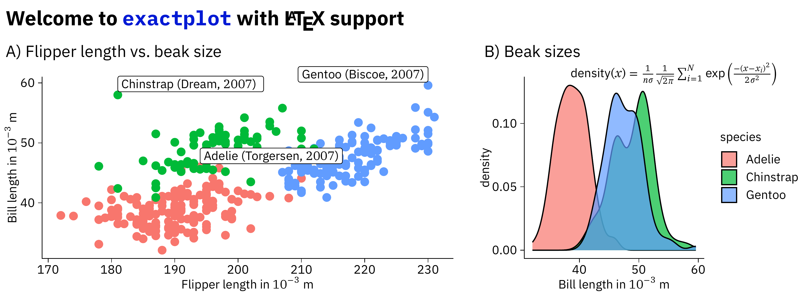
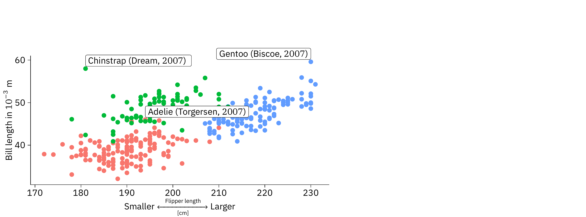

<!-- README.md is generated from README.Rmd. Please edit that file -->

# exactplot

<!-- badges: start -->
<!-- badges: end -->

The goal of `exactplot` is to produce millimeter-exact figure layouts
and annotate your plots with the full power of Latex. `exactplot` wraps
around [`tikzDevice`](https://daqana.github.io/tikzDevice/) and provides
utility functions to compose grid plots (e.g., `ggplot2` output, but not
base plots).

## Disclaimer

This is a *work-in-progress* package and mainly serves as a collection
of scripts that I have used in my past papers to produce my scientific
figures. I currently do not plan to release it on CRAN and I am only
planning to add features if I need them for my work. If you would like
to see some feature included, please open a pull request, or feel free
to fork the package.

## Installation

You can install the development version of `exactplot` from Github:

``` r
devtools::install_github("const-ae/exactplot")
```

You might need to install additional fonts. By default, `exactplot` uses
the [IBM Plex](https://github.com/IBM/plex) font family. On Mac, you can
install them using brew.

``` shell
brew install --cask font-ibm-plex-sans font-ibm-plex-mono font-ibm-plex-math
```

If you don’t have a functional Latex installation, exactplot can help
you set that up:

``` r
exactplot::setup_latex()
```

## Example

``` r
library(exactplot)
library(tidyverse)
library(palmerpenguins)
```

The `xp_init` function sets consistent fonts and font sizes, adds
additional packages to the `options("tikzLatexPackages")`, and sets the
default `ggplot2` theme. The default font sizes are available through
the `xp` object. This is needed when you, want to use larger or smaller
text in `geom_text()` (remember to change the `size.unit = "pt"`).

``` r
xp_init()
xp$fontsize
#> [1] 8
```

Make some simple example plots.

``` r
scatter_plot <- penguins |>
  mutate(label = paste0(species, " (", island, ", $", year,"$)")) |>
  ggplot(aes(x = flipper_length_mm, y = bill_length_mm)) +
    geom_point(aes(color = species), show.legend = FALSE) +
    geom_label(data = \(x) slice_max(x, bill_length_mm, by = species), 
               aes(label = label, hjust = ifelse(flipper_length_mm < 200, 0, 1)), vjust = -0.2) +
    labs(x = "Flipper length in $10^{-3}$ m", y = "Bill length in $10^{-3}$ m") +
    coord_cartesian(clip = "off")

beak_lengths <- penguins |>
  ggplot(aes(x = bill_length_mm)) +
   geom_density(aes(fill = species), alpha = 0.7 ) +
   labs(x = "Bill length in $10^{-3}$ m")
```

Combine the two plots with some additional annotations. If you call this
function without specifying the filename, you get a quick preview
without the latex rendering. By default, `exactplot` uses LuaLatex for
rendering, because of its superior font support.

``` r
xp_compose_plots(
  xp_text("Welcome to \\texttt{exactplot} with \\LaTeX{} support", x = 1, y = 2, 
          fontsize = xp$fontsize_large, fontface = "bold"),
  xp_text("A) Flipper length vs.\\ beak size", x = 1, y = 8),
  xp_plot(scatter_plot, x = 0, y = 12, width = 80, height = 40),
  
  xp_text("B) Beak sizes", x = 84, y = 8),
  xp_plot(beak_lengths, x = 82, y = 12, width = 58, height = 40),
  xp_text("$\\textrm{density}(x) = \\frac{1}{n\\sigma}\\frac{1}{\\sqrt{2\\pi}}\\sum_{i=1}^N{\\exp\\left(\\frac{-(x-x_i)^2}{2\\sigma^2}\\right)}$",
           x = 99, y = 12, fontsize = xp$fontsize_small),
  
  width = 140, height = 52,
  keep_tex_file = FALSE, filename = "man/example.pdf"
)
#> Using TikZ metrics dictionary at:
#>  README-tikzDictionary
#> gg[gg1]
#> gg[gg2]
#> Warning: Removed 2 rows containing missing values or values outside the scale range
#> (`geom_point()`).
#> gg[gg3]
#> gg[gg4]
#> Warning: Removed 2 rows containing non-finite outside the scale range
#> (`stat_density()`).
#> gg[gg5]
#> gg[gg6]
#> [1] "example.pdf"
```

Display the output:

``` r
print(magick::image_read_pdf("man/example.pdf", density = 600), info = FALSE)
```



# Load additional Latex packages

The `\xleftrightarrow` is defined in the `mathtools` Latex package. You
can load it by calling `xp_add_latex_package`.

``` r
xp_add_latex_package("mathtools")

adv_label_pl <- scatter_plot +
  labs(x = "Smaller $\\xleftrightarrow[\\text{[cm]}]{\\text{\\quad Flipper length\\quad}}$ Larger") +
  theme(axis.title.x = element_text(margin = margin(4, 0, 0, 0, "pt")))

xp_compose_plots(
  xp_plot(adv_label_pl, x = 0, y = 12, width = 80, height = 40),
  
  width = 140, height = 52, filename = "man/example2.pdf"
)
#> Warning: Removed 2 rows containing missing values or values outside the scale range
#> (`geom_point()`).
#> gg[gg1]
#> [1] "example2.pdf"
```

Display the output:

``` r
print(magick::image_read_pdf("man/example2.pdf", density = 600), info = FALSE)
```



# Session Info

``` r
sessionInfo()
#> R version 4.4.1 (2024-06-14)
#> Platform: aarch64-apple-darwin20
#> Running under: macOS Sonoma 14.6
#> 
#> Matrix products: default
#> BLAS:   /Library/Frameworks/R.framework/Versions/4.4-arm64/Resources/lib/libRblas.0.dylib 
#> LAPACK: /Library/Frameworks/R.framework/Versions/4.4-arm64/Resources/lib/libRlapack.dylib;  LAPACK version 3.12.0
#> 
#> locale:
#> [1] en_US.UTF-8/en_US.UTF-8/en_US.UTF-8/C/en_US.UTF-8/en_US.UTF-8
#> 
#> time zone: Europe/Berlin
#> tzcode source: internal
#> 
#> attached base packages:
#> [1] stats     graphics  grDevices utils     datasets  methods   base     
#> 
#> other attached packages:
#>  [1] palmerpenguins_0.1.1 lubridate_1.9.3      forcats_1.0.0       
#>  [4] stringr_1.5.1        dplyr_1.1.4          purrr_1.0.2         
#>  [7] readr_2.1.5          tidyr_1.3.1          tibble_3.2.1        
#> [10] ggplot2_4.0.1        tidyverse_2.0.0      exactplot_0.1.5     
#> 
#> loaded via a namespace (and not attached):
#>   [1] bitops_1.0-9                remotes_2.5.0              
#>   [3] rlang_1.1.4                 magrittr_2.0.3             
#>   [5] matrixStats_1.4.1           compiler_4.4.1             
#>   [7] vctrs_0.6.5                 profvis_0.4.0              
#>   [9] pkgconfig_2.0.3             crayon_1.5.3               
#>  [11] fastmap_1.2.0               magick_2.8.5               
#>  [13] XVector_0.46.0              ellipsis_0.3.2             
#>  [15] labeling_0.4.3              Rsamtools_2.22.0           
#>  [17] promises_1.3.2              rmarkdown_2.29             
#>  [19] tzdb_0.4.0                  sessioninfo_1.2.2          
#>  [21] UCSC.utils_1.2.0            strawr_0.0.92              
#>  [23] tinytex_0.54                xfun_0.50                  
#>  [25] zlibbioc_1.52.0             cachem_1.1.0               
#>  [27] GenomeInfoDb_1.42.0         jsonlite_1.8.9             
#>  [29] later_1.4.0                 rhdf5filters_1.18.0        
#>  [31] DelayedArray_0.32.0         Rhdf5lib_1.28.0            
#>  [33] BiocParallel_1.40.0         parallel_4.4.1             
#>  [35] R6_2.5.1                    plyranges_1.26.0           
#>  [37] stringi_1.8.4               RColorBrewer_1.1-3         
#>  [39] rtracklayer_1.66.0          pkgload_1.4.0              
#>  [41] GenomicRanges_1.58.0        Rcpp_1.0.13-1              
#>  [43] SummarizedExperiment_1.36.0 knitr_1.49                 
#>  [45] filehash_2.4-6              usethis_3.1.0              
#>  [47] IRanges_2.40.0              timechange_0.3.0           
#>  [49] httpuv_1.6.15               Matrix_1.7-1               
#>  [51] tidyselect_1.2.1            rstudioapi_0.17.1          
#>  [53] abind_1.4-8                 yaml_2.3.10                
#>  [55] codetools_0.2-20            miniUI_0.1.1.1             
#>  [57] curl_6.2.1                  qpdf_1.3.4                 
#>  [59] pkgbuild_1.4.5              lattice_0.22-6             
#>  [61] Biobase_2.66.0              shiny_1.10.0               
#>  [63] withr_3.0.2                 S7_0.2.0                   
#>  [65] askpass_1.2.1               evaluate_1.0.1             
#>  [67] gridGraphics_0.5-1          desc_1.4.3                 
#>  [69] urlchecker_1.0.1            Biostrings_2.74.0          
#>  [71] pillar_1.10.2               MatrixGenerics_1.18.0      
#>  [73] stats4_4.4.1                generics_0.1.3             
#>  [75] rprojroot_2.0.4             RCurl_1.98-1.16            
#>  [77] hms_1.1.3                   plotgardener_1.12.0        
#>  [79] S4Vectors_0.44.0            scales_1.4.0               
#>  [81] xtable_1.8-4                glue_1.8.0                 
#>  [83] tikzDevice_0.12.6           tools_4.4.1                
#>  [85] BiocIO_1.16.0               data.table_1.16.2          
#>  [87] GenomicAlignments_1.42.0    pdftools_3.4.1             
#>  [89] fs_1.6.5                    XML_3.99-0.17              
#>  [91] cowplot_1.1.3               rhdf5_2.50.0               
#>  [93] grid_4.4.1                  devtools_2.4.5             
#>  [95] GenomeInfoDbData_1.2.13     restfulr_0.0.15            
#>  [97] cli_3.6.3                   S4Arrays_1.6.0             
#>  [99] gtable_0.3.6                yulab.utils_0.1.8          
#> [101] digest_0.6.37               BiocGenerics_0.52.0        
#> [103] SparseArray_1.6.0           ggplotify_0.1.2            
#> [105] rjson_0.2.23                htmlwidgets_1.6.4          
#> [107] farver_2.1.2                memoise_2.0.1              
#> [109] htmltools_0.5.8.1           lifecycle_1.0.4            
#> [111] httr_1.4.7                  mime_0.12
```
